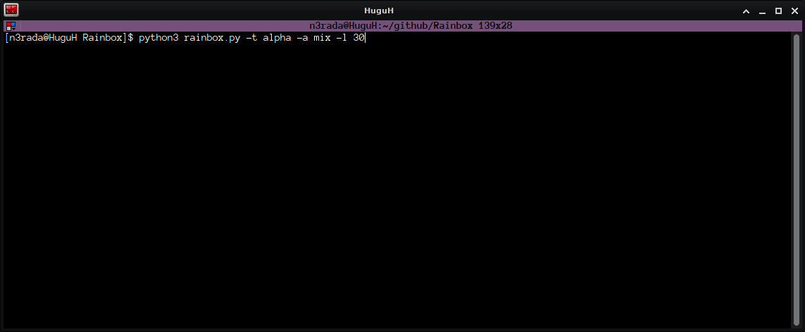
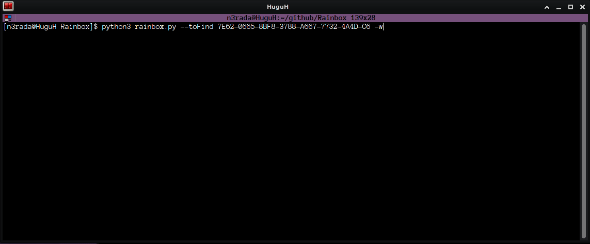

                            ██████╗  █████╗ ██╗███╗   ██╗██████╗  ██████╗ ██╗  ██╗
                            ██╔══██╗██╔══██╗██║████╗  ██║██╔══██╗██╔═══██╗╚██╗██╔╝
                            ██████╔╝███████║██║██╔██╗ ██║██████╔╝██║   ██║ ╚███╔╝ 
                            ██╔══██╗██╔══██║██║██║╚██╗██║██╔══██╗██║   ██║ ██╔██╗ 
                            ██║  ██║██║  ██║██║██║ ╚████║██████╔╝╚██████╔╝██╔╝ ██╗
                            ╚═╝  ╚═╝╚═╝  ╚═╝╚═╝╚═╝  ╚═══╝╚═════╝  ╚═════╝ ╚═╝  ╚═╝

                                This project is for educational purposes only.
                                    Don't use it for illegal activities.
                          I don't support nor condone illegal or unethical actions.
                       I can't be held responsible for possible misuse of this software.


`Rainbox` is a generator of wifi router keys from major French manufacturers (i.e. Bouygues Telecom, Orange, SFR, Free).

Read this in other languages: [French](README.fr.md)

## About
Based on the collection of various router security keys, the purpose of this generator is to understand the typical security key pattern and to show that it can be exploited to create a suitable generator. Although, you will notice that most of the time, the chance to find the right key is not very big. <br/>

## Installation
* Clone the repository then go to the eponymous folder and launch "rainbox.py" with python 3.

## Use
**By default, if you don't specify the number of cores, the tool will take all your cores.**

* To continuously generate mixed case-sensitive keys of length 18 in hexadecimal the following command is used: 
```
python3 rainbox.py -t alpha -a mix -l 30
```
<p align="center">
  
</p>

* To increase your personal word list using 4 cores, just do:
```
python3 rainbox.py -c 4 -t hexa -a up -l 18 -w True
```
* To increase your personal word list and searching for a specific key:
```
python3 rainbox.py -tf <YouKey> -w
```
<p align="center">
  
</p>

* If you want to test in how much time the generator can find your personal key:
```
python3 rainbox.py -tf <YouKey>
```
*Your key can even been writen with dash nor nothing (e.g. FVoX-kxNU-4Urh-tLiZ-Fq or FVoXkxNU4UrhtLiZFq).*

* You can combine this tool with [aircrack-ng](https://github.com/aircrack-ng/aircrack-ng) to [crack wpa](https://www.aircrack-ng.org/doku.php?id=cracking_wpa) either with direct [pipe](https://en.wikipedia.org/wiki/Pipeline_(Unix)) or with created wordlist as usual:
```
python3 rainbox.py -c 8 -t hexa -l 16 | aircrack-ng -b [bssid] -w - [.cap file]
```
```
aircrack-ng -b [bssid] -w 18-mixed-hexa.txt [.cap file]
```
## Implementation choices

Let's recall the different ways of "combining" different elements. <br/>
Let's take the following array: `['A','B','C']`<br/>
Among the different possible changes, working with two elements we have:<br/>
* When the **order doesn't matter**, it is a **Combination** : `['AB', 'AC', 'BC']`
* When the **order does matter** it is a **Permutation** : `['AB', 'AC', 'BA', 'BC', 'CA', 'CB']`
* When you want to make a **permutation with repetition**, this is called a **Cartesian product** : `['AA', 'AB', 'AC', 'BA', 'BB', 'BC', 'CA', 'CB', 'CC']`

For the continuation, we define as:
* A **letter** : any alphanumeric character.
* A **fragment** : any group of 4 letters.

*Thus a letter could be "A","5","F","2" and a corresponding fragment "A5F2","AF25","F25A" etc.*

For fragments:
* **Order is clearly important**: 2A16 is different from 61A2. <br/>
* **You can have replacement**: 2A16 or 2AA6 or even 2A1A. <br/>

For fragment construction, I choose to use cartesian product's with some variable condition such as **"not more than x times a letter"**.<br/>

If A = 5E5F and B = A5CE, here, for wifi key's you can set some hypothesis like *Never ever have such thing like AA* (i.e. you don't want to have the same fragment twice (Problem with Cartesian Product's)).<br/>

The following rules are therefore laid down:
* **Rule 1** > **Never two digital fragments that follow each other.** (Avoid, by extension, fully digital keys like *0001-0002-0003-0005-0006-0007-02*)
* **Rule 2** > **Not twice the same fragment in a key.** (i.e. Avoid keys like *DECD-F9F9-B8CA-F9F9-89F5-F9F9-09F0-D59A-BA*)

**Concerning multiprocessing**, in view of the present constraints to manage the writing of several processes within the same file while checking for duplicates, **I chose to assign a file to each process**. The user cuts the creation of keys with a keyboard pause and then, the buffer files are merged into a file which is itself emptied of all duplicates.

Multiprocessing gives rise to the **problem of sharing global variables between these processes**. <br/>
I therefore preferred to "carry " the "fragL" variable between each function rather than trying to have it defined among each process. Maybe there would be a better solution here.

## Samples analysis
Based on the keys I have been able to observe, at the date I am writing this (2021) the French [ISPs](https://en.wikipedia.org/wiki/Internet_service_provider) proceed as follows:

* **Bouygues-Telecom** : 30 hexanumeric characters keys for ADSL 
* **Orange** : 26 hexanumeric characters keys for ADSL and 18 mixed alphanumeric characters keys for Fiber Optic
* **SFR** : 20 lowercase alphanumeric characters keys for both ADSL and Fiber Optic
* **Free** : Seems to have no logic at all !

*They are all case-sensitive.*

## Author 
**Azaël MARTIN** - [n3rada](https://github.com/n3rada)

## License
Rainbox is licensed under the terms of the GPL3 Licence and is available for free - see the [LICENSE](LICENSE) file for details.

## Some links
* https://www.mathsisfun.com/combinatorics/combinations-permutations.html
* https://en.wikipedia.org/wiki/Cartesian_product#A_deck_of_cards
